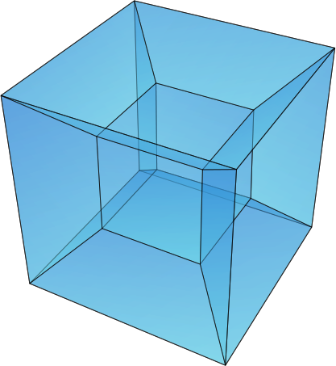
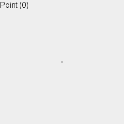

# DERPO
n-Dimensional Euclidean Renderer Python OpenGL
<!--
Nothing here
-->

  <a href="https://github.com/acsstudios/derpo/edit/contributors">
    
  <a/>
  <a href="https://github.com/acsstudios/derpo/network/members">
    
  <a/>
  <a href="https://github.com/acsstudios/derpo/stargazers">
    
  <a/>
  <a href="https://github.com/acsstudios/derpo/issues">
    
  <a/>
  <a href="https://github.com/acsstudios/derpo/blob/main/LICENSE">
    
  <a/>

<!-- PROJECT LOGO -->
 

  

  <h3 align="center">n-Dimensional Euclidean Renderer Python OpenGL</h3>

  

    A project to render any shape of any dimension including fractals
     
    <a href="https://github.com/acsstudios/derpo"><strong>Explore the docs »</strong></a>
     
     
    <a href="https://github.com/acsstudios/derpo">View Demo</a>
    ·
    <a href="https://github.com/acsstudios/derpo/issues">Report Bug</a>
    ·
    <a href="https://github.com/acsstudios/derpo/issues">Request Feature</a>
  

